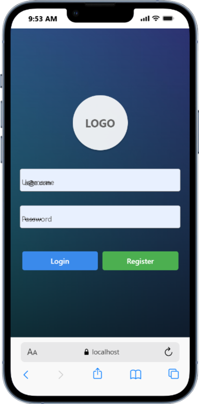
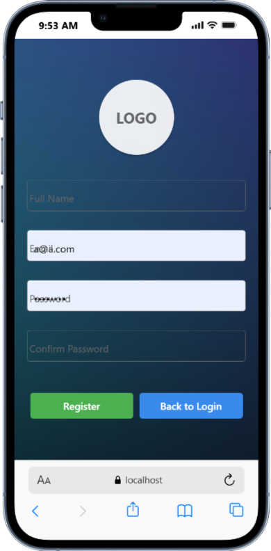
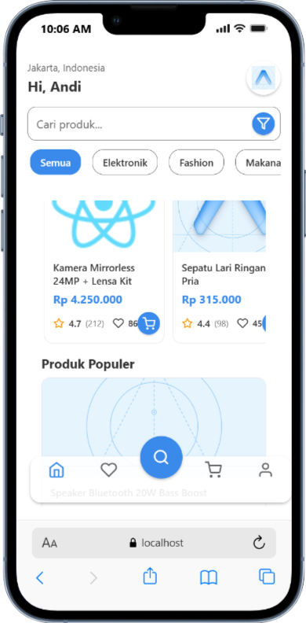
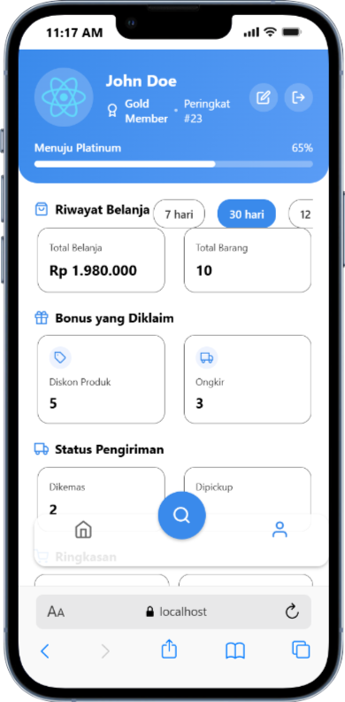
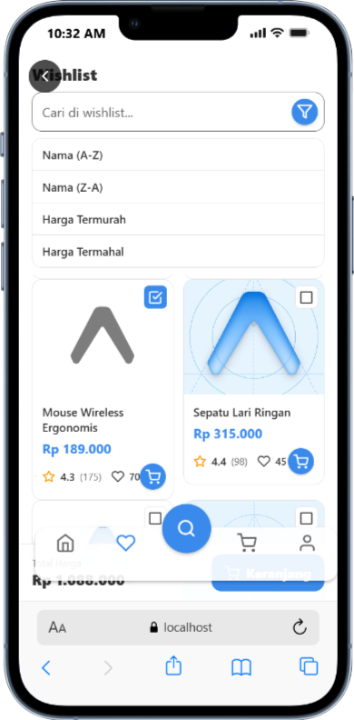

# Materi Kursus React Native Expo — Kelas Coding Advance (LKP Naura)

Repository ini berisi materi dan contoh aplikasi untuk kelas Coding Advance menggunakan React Native (Expo) di LKP Naura. Materi difokuskan pada pembuatan UI modern, navigasi file-based (`expo-router`), dan fitur e-commerce dasar yang dapat dikembangkan lebih lanjut.

Website LKP Naura: https://lkpnaura.com

## Cara Memulai

1. Instal dependensi

   ```bash
   npm install
   ```

2. Jalankan aplikasi

   ```bash
   npx expo start
   ```

Saat dijalankan, Anda akan melihat opsi untuk membuka aplikasi di:

- [Development build](https://docs.expo.dev/develop/development-builds/introduction/)
- [Android emulator](https://docs.expo.dev/workflow/android-studio-emulator/)
- [iOS simulator](https://docs.expo.dev/workflow/ios-simulator/)
- [Expo Go](https://expo.dev/go), sandbox terbatas untuk mencoba pengembangan dengan Expo

Anda dapat mulai mengembangkan dengan mengedit berkas di direktori **app**. Proyek ini menggunakan [routing berbasis berkas](https://docs.expo.dev/router/introduction) melalui `expo-router`.

## Reset Proyek (Opsional)

When you're ready, run:

```bash
npm run reset-project
```

Perintah ini akan memindahkan kode starter ke direktori **app-example** dan membuat direktori **app** kosong tempat Anda dapat mulai mengembangkan.

## Referensi Belajar

Untuk mempelajari lebih lanjut pengembangan proyek dengan Expo, lihat sumber berikut:

- [Dokumentasi Expo](https://docs.expo.dev/): Pelajari dasar-dasar, atau topik lanjutan melalui [panduan](https://docs.expo.dev/guides).
- [Tutorial Learn Expo](https://docs.expo.dev/tutorial/introduction/): Tutorial langkah demi langkah untuk membuat proyek yang berjalan di Android, iOS, dan web.

## Komunitas

Gabung komunitas pengembang yang membuat aplikasi universal.

- [Expo di GitHub](https://github.com/expo/expo): Lihat platform open source dan berkontribusi.
- [Discord community](https://chat.expo.dev): Berdiskusi dengan pengguna Expo dan ajukan pertanyaan.

## Tangkapan Layar
Berikut beberapa tampilan utama aplikasi (gambar ada di folder `skrinsut/`):









## Teknologi yang Digunakan
- React Native `0.81.5` (via Expo SDK `~54`)
- React `19.1.0`
- Expo Router `~6.0.14` (file-based routing & tabs)
- React Navigation Bottom Tabs `^7.4.0`
- Reanimated `~4.1.1`
- Gesture Handler `~2.28.0`
- Safe Area Context `~5.6.0`
- Screens `~4.16.0`
- React Native Web `~0.21.0`
- @expo/vector-icons `^15.0.3`
- Expo Image `~3.0.10`
- Expo Linear Gradient `^15.0.7`
- Expo Blur `^15.0.7`
- Expo Constants `~18.0.10`
- Expo Font `~14.0.9`
- Expo Haptics `~15.0.7`
- Expo Linking `~8.0.8`
- Expo Splash Screen `~31.0.10`
- Expo Status Bar `~3.0.8`
- Expo Symbols `~1.0.7`
- Expo System UI `~6.0.8`
- Expo Web Browser `~15.0.9`

### Dev Dependencies
- TypeScript `~5.9.2`
- ESLint `^9.25.0` dengan `eslint-config-expo ~10.0.0`
- @types/react `~19.1.0`

## Fitur Utama (Saat Ini)
- Halaman Login dan Register (UI dasar)
- Beranda (Home) dengan pencarian, chip kategori, dan kartu produk
- Profil bergaya dashboard: metrik riwayat belanja, bonus, status pengiriman, serta ringkasan Cart/Wishlist
- Edit Profil: modal ganti foto (kamera/galeri placeholder), form Nama/Email/Password/No HP/Provinsi/Kota/Alamat
- Wishlist, Cart, Payment, Product Detail dengan layout konsisten
- Navigasi dengan `expo-router` dan bottom tabs

## Struktur Proyek (Ringkas)
- `app/` — layar dan routing berbasis file (`expo-router`)
  - `(tabs)/` — grup layar tab (`index`, `profile`, `search`)
  - `login.tsx`, `register.tsx`, `editProfile.tsx`, `cart.tsx`, `favorite.tsx`, `payment.tsx`, `productDetail.tsx`
- `components/` — komponen UI reusable (Input, Button, Product Card, Chip Scroll, Avatar)
- `assets/images/` — aset gambar
- `app/constants/` — warna dan util responsif

## Cara Menjalankan
1. Install dependencies
   ```bash
   npm install
   ```
2. Jalankan aplikasi (pilih platform)
   ```bash
   npx expo start
   # atau
   npm run web
   npm run android
   npm run ios
   ```

## Improvisasi & Rencana Pengembangan
- Ganti Foto: integrasikan `expo-image-picker` (dan opsional `expo-camera`) agar modal Kamera/Galeri berfungsi penuh.
- Provinsi/Kota: integrasi API RajaOngkir (gunakan env `EXPO_PUBLIC_RAJAONGKIR_API_KEY`) dan dropdown cascade.
- State Management: tambahkan `Zustand` atau `Redux Toolkit` untuk data global (cart/wishlist/profile).
- Penyimpanan Aman: gunakan `expo-secure-store` untuk token login; atau `@react-native-async-storage/async-storage` untuk data non-sensitif.
- Theming: dukung Dark Mode dan tema kustom.
- Testing: setup `jest` dan `@testing-library/react-native` untuk komponen & navigasi.
- i18n: dukung multi-bahasa dengan `react-intl` atau `i18next`.
- Build & Deploy: pertimbangkan EAS (Expo Application Services) untuk build produksi.

## Catatan Tambahan
- Versi Node yang direkomendasikan: `>= 18`.
- Alias path `@/*` sudah diatur di `tsconfig.json`.
- Entri utama Expo: `expo-router/entry` (lihat `package.json`).
